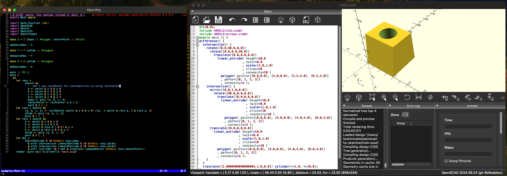

# OpenSCAD-hs-Sketcher
OpenSCAD-hs-Sketcher is a Haskell-based Domain Specific Language (DSL) for generating OpenSCAD code from 2D sketches. It allows users to build flexible, parametric models that adjust based on input parameters, ensuring efficient design workflows.

## Features
Create 2D sketches with Haskell code.
Automatically generate OpenSCAD scripts.

## Requirements
The generated OpenSCAD code requires OpenSCAD with BOSL2 library installed. 

For optimal performance, use the OpenSCAD development snapshot and enable `use manifold` to achieve up to 100x faster rendering.

## Setup

- `git clone https://github.com/tsukimizake/openscad-hs-sketcher` on your stack project directory.
- Add `./openscad-hs-sketcher` to your `stack.yaml` packages.
- Add `openscad-hs-sketcher` to your `package.yaml` dependencies.

## Usage
See `examples/Main.hs` for basic usage. Sketch APIs are defined in `src/Sketch.hs`. Other OpenSCAD functions are defined in `src/OpenSCAD.hs`, which is almost the same as https://github.com/BrechtSerckx/OpenSCAD .
