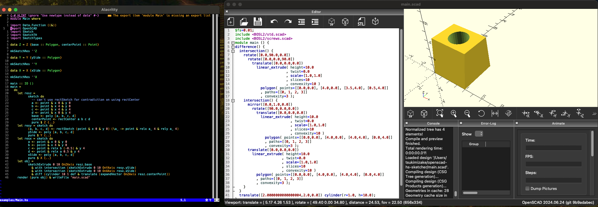

# OpenSCAD-hs-Sketcher
OpenSCAD-hs-Sketcher is a Haskell-based Domain Specific Language (DSL) for generating OpenSCAD code from 2D sketches. It allows users to model and design 2D objects programmatically, leveraging the power of Haskell's type system and functional programming.

## Features
Create 2D sketches with Haskell code.
Automatically generate OpenSCAD scripts.

## Usage
see `examples/Main.hs` for basic usage. sketch APIs are defined in `src/Sketch.hs`. Other OpenSCAD functions are defined in `src/OpenSCAD.hs`, which is almost the same as https://github.com/BrechtSerckx/OpenSCAD .
